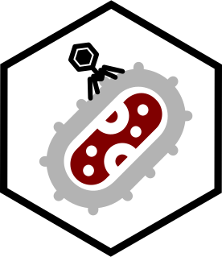

Fun with *Klebsiella* 
====================================================================================================

<!-- badges: start -->

 <!--badges: end -->

The present repository contains code needed for some components of the project: *[insert name here]*, including:

* Cleaning of raw and meta datasets
* Other stuff, presumably

Repo Diagram
----------------------------------------------------------------------------------------------------
Stay tuned.

